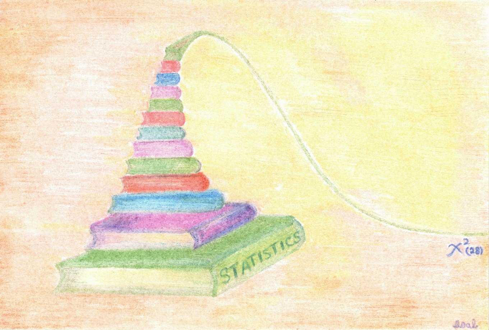

# Welcome to Data Analysis Activities

```{r out.width = "65%", fig.align = "center", echo = FALSE}

```

This book contains a variety of statistical activities using real-life data sets. It is intended for developing statistical reasoning at an introductory to an intermediate level by explaining patterns in the data, interpreting and communicating results within the context of data, and making data-based arguments and inference. Each chapter corresponds to one statistical activity with a set of learning objectives.

Click on a link below to access a specific statistical activity.

- [Activity 1: Exploring Categorical Data](#activity-1---exploring-categorical-data)
- [Activity 2 - Exploring Quantitative Data](#activity-2---exploring-quantitative-data)
- [Activity 3 - Sampling Distributions Related to the Normal Population](#activity-3---sampling-distributions-related-to-the-normal-population)
- [Activity 4 - Applications of Limit Theorem](#activity-4---applications-of-limit-theorem)
- [Activity 5 - Estimation with Confidence Intervals](#activity-5---estimation-with-confidence-intervals)
- [Activity 6 - Introduction to Hypothesis Testing and Concepts](#activity-6---introduction-to-hypothesis-testing-and-concepts)
- [Activity 7 - Errors in Tests, Statistical Power & Sample Size](#activity-7---errors-in-tests-statistical-power--sample-size)
- [Activity 8 - Comparing Groups](#activity-8---comparing-groups)
- [Activity 9 - Analysis of Categorical Data](#activity-9---analysis-of-categorical-data)

---

**Note:** Solution to each statistical activity is shared at the instructor's discretion.